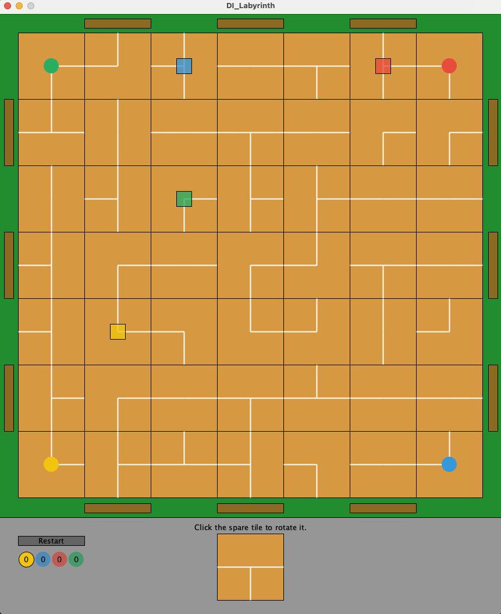

> This project was created as a part of the module "Programmierung interaktiver Systeme" at THM
# Das Verrückte Labyrinth (PiS, SoSe 2021)

## Kurzbeschreibung

Bei meinem Projekt handelt es sich um eine digitale Implementierung des Gesellschaftsspiels „Das verrückte Labyrinth“
von Ravensburger. Dabei gibt es vier Spieler, die mit ihren Spielfiguren (Kreise) die gleichfarbigen Schätze (Quadrate)
einsammeln. Wer zuerst alle seine Schätze eingesammelt hat und danach zu seiner Startposition zurückgekehrt ist, hat
gewonnen. Die Besonderheit ist, dass sich das Labyrinth, in dem sich die Spieler bewegen, verändert. Denn vor jedem Zug
muss der jeweilige Spieler das rotierbare „übrige Teil“ in eine der Zeilen oder Spalten des Labyrinths schieben. Das auf
der gegenüberliegenden Seite herausgeschobene Teil wird das neue „übrige Teil“. Danach darf sich der Spieler frei im
Labyrinth bewegen, insofern er einen Weg zu seinem Ziel findet. Falls man den gesuchten Schatz in dieser Runde nicht
erreichen kann, sollte man versuchen sich so zu positionieren, dass es in der nächsten Runde klappt.
(137 Wörter)

## Screenshot

## Bedienungshinweise

### Bedienung der grafischen Benutzeroberfläche

Die Spieler sind reihum am Zug und der gelbe Spieler startet. Welcher Spieler am Zug ist, kann man am unten links
hervorgehobenen Kreis erkennen. In der Mitte des Kreises steht die Zahl der Schätze, die der jeweilige Spieler bis dato
eingesammelt hat. Mit der darüber liegenden Schaltfläche („Restart“) kann man das Spiel neustarten. Zusammen mit dem
„übrigen Teil“, welches sich unten in der Mitte befindet und durch Klicken rotiert werden kann, bildet das grau
eingefasste Gebiet den Menübereich. Darüber liegt der Labyrinthbereich, welcher in der Mitte das Spielfeld beheimatet
und am Rand die braunen Schaltflächen, durch die die jeweilige Reihe oder Spalte eingeschoben wird. Auch alle
Labyrinthteile sind quasi Schaltflächen und der aktuelle Spieler kann sich durch Klicken auf das jeweilige Feld dorthin
bewegen. Es ist auch möglich stehenzubleiben, dafür klickt man einfach auf die aktuelle Position. Das GUI gibt einem
auch eine visuelle Rückmeldung, ob die eben versuchte Aktion erlaubt ist oder nicht. Wenn ja, leuchtet das gedrückte
Element schwarz auf, wenn nicht rot. Das Spiel bleibt so lange im gleichen Zustand, bis eine erlaubte Aktion
durchgeführt wurde.

### Spielregeln

Eine ausführlichere Erklärung der Spielregeln kann man in der
[originalen Spielanleitung](https://www.ravensburger.de/spielanleitungen/ecm/Spielanleitungen/26446%20anl%201637944.pdf?ossl=pds_text_Spielanleitung)
nachlesen. Um das Spiel in die digitale Welt zu überführen, wurden jedoch auch ein paar Anpassungen vorgenommen. Die
Schatzsuche wurde grundlegend verändert. Anstatt mit Karten und vorgedruckten Schätzen zu arbeiten, erscheint
automatisch ein Schatz pro Spieler zufällig auf dem Spielbrett. Wurde dieser eingesammelt, erscheint ein neuer an einer
anderen Position, bis alle benötigten Schätze eingesammelt wurden. Standardmäßig muss jeder Spieler zwei Schätze
einsammeln. Da es sich bei dem Spiel jetzt nicht mehr um ein Brettspiel, sondern ein Computerspiel handelt, ist es auch
nicht mehr nötig vorgefertigte Labyrinthteile zu verwenden. Deshalb wird die Verteilung und Ausrichtung der Teile nun
vom Zufall gesteuert. Außerdem ist es nicht mehr möglich, dass zwei Spieler auf demselben Feld stehen.

Von den in der Anleitung beschriebenen Regeln möchte ich die folgenden noch einmal besonders hervorheben, da sie
automatisch angewandt werden und für die Tests von besonderer Relevanz sind. Eine Spielfigur kann das Spielbrett nie
verlassen. Wird sie jedoch über die Kante des Bretts geschoben, wird sie auf der gegenüberliegenden Seite platziert. Bei
Schätzen ist dies allerdings nicht der Fall, sie bleiben auch auf dem Labyrinthteil, wenn dieses aus dem Spielfeld
herausgeschoben wurde. Sie können also auch auf dem „übrigen Teil“ landen und dann an beliebiger Stelle wieder
eingesetzt werden. Neue Schätze können (beim Spielstart, oder nachdem ein anderer Schatz eingesammelt wurde) jedoch
nicht auf dem „übrigen Teil“, oder auf den Ecken (Startpositionen der Spieler) erscheinen. Des Weiteren ist es nicht
erlaubt, das „übrige Teil“ wieder in die Stelle zurückzuschieben, aus der es herausgeschoben wurde, weil man so einfach
das ursprüngliche Labyrinth wieder herstellen könnte.

### Editierbare Codezeilen

Es gibt zwei Stellen im Code, die man bearbeiten kann, um eine andere Spielerfahrung zu haben. In der
Klasse `DI_Labyrinth` lässt sich mit `w` die Auflösung bearbeiten, z. B. um das GUI an kleinere oder größere Bildschirme
anzupassen. Außerdem kann man in dieser Klasse bei der Variable `labyrinth` dem Konstruktor der Instanz
von `AL_Labyrinth` ein `Random`-Objekt mit einem festen Seed übergeben, damit das Labyrinth bei Programmstart immer
gleich aussieht. Für die Tests wurde beispielsweise der Seed 0 übergeben. Auch die schon übergebene Zahl 2 für
`maxTreasures`, also die Anzahl an Schätzen die jeder Spieler einsammeln muss, kann hier angepasst werden.

## Dateiübersicht und Lines of Code

    /README.md
    /Screenshot.png
    /build.gradle
    /core.jar
    /src/main/java/DasVerrueckteLabyrinth/AL_Labyrinth.java
    /src/main/java/DasVerrueckteLabyrinth/Button.java
    /src/main/java/DasVerrueckteLabyrinth/DI_Labyrinth.java
    /src/main/java/DasVerrueckteLabyrinth/ImmutableTile.java
    /src/main/java/DasVerrueckteLabyrinth/Labyrinth.java
    /src/main/java/DasVerrueckteLabyrinth/Shape.java
    /src/main/java/DasVerrueckteLabyrinth/Tile.java
    /src/test/java/DasVerrueckteLabyrinth/ImmutableLabyrinthTest.java
    /src/test/java/DasVerrueckteLabyrinth/MutableLabyrinthTest.java
    /src/test/java/DasVerrueckteLabyrinth/TileTest.java
    /src/test/java/DasVerrueckteLabyrinth/TreasureTest.java

    -------------------------------------------------------------------------------
    Language                     files          blank        comment           code
    -------------------------------------------------------------------------------
    Java                             7             69             59            466
    -------------------------------------------------------------------------------
    SUM:                             7             69             59            466
    -------------------------------------------------------------------------------

## Anmerkungen

* In der Klasse `Tile` sind zwei Methoden (`randomOf()` und `copyOf()`) bewusst als `static` deklariert. Diese Anwendung
  von `static` soll nicht die Objektorientierung umgehen, sondern beide Methoden sind eine Alternative zum Konstruktor
  zur Erzeugung bestimmter `Tile`-Objekte (eines zufälligen und einer Kopie eines anderen `Tile`-Objekts).
* Die cloc-Tabelle im Abschnitt [Dateiübersicht und Lines of Code](#dateiübersicht-und-lines-of-code) wurde aus dem
  Verzeichnis /src/main aufgenommen, um nur die LOC der eigentlichen Anwendung zu zählen und nicht zusätzlich die der
  Tests.
* Die verwendete `core.jar` wurde für die Verwendung auf MacOS bearbeitet und muss ggf. durch eine andere Datei passend
  für das jeweilige Betriebssystem ersetzt werden.

## Verwendete Quellen

* https://processing.org/reference/ (Abruf, 03.07.2021)
* https://discourse.processing.org/t/error-hello-processing-jdk-10-osx-high-sierra-com-apple-eawt-quithandler-not-supported/1396
  (Abruf, 03.07.2021)
* Herstellerseite: https://www.ravensburger.de/produkte/spiele/familienspiele/das-verrueckte-labyrinth-26446/index.html
  (Abruf, 03.07.2021)
* Spielanleitung „Das verrückte
  Labyrinth“: https://www.ravensburger.de/spielanleitungen/ecm/Spielanleitungen/26446%20anl%201637944.pdf?ossl=pds_text_Spielanleitung
  (Abruf, 03.07.2021)
